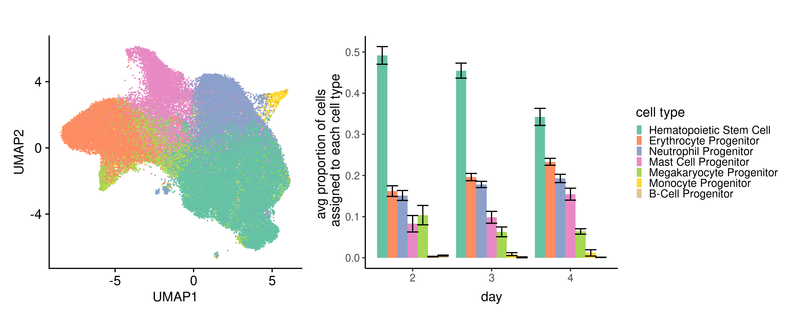
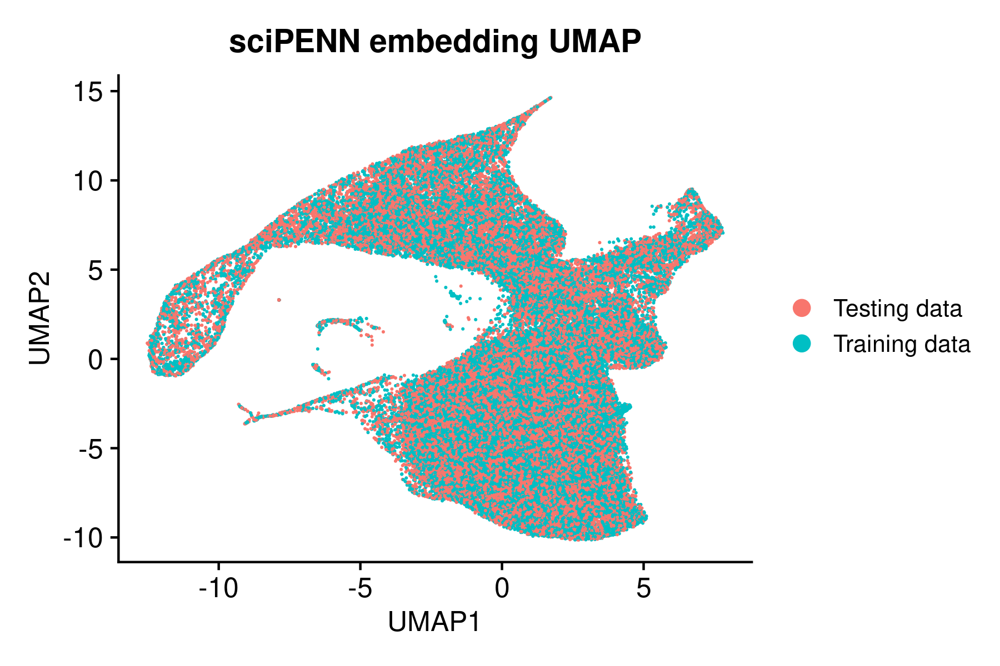
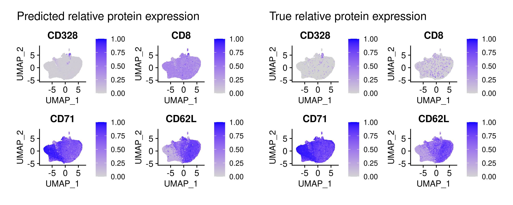
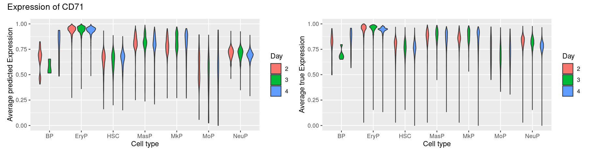
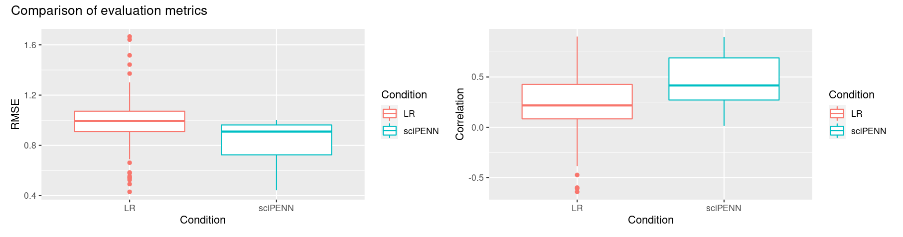

```{r setup, include=FALSE}
knitr::opts_chunk$set(echo = TRUE)
library(ggplot2)
library(patchwork)
```

## Introduction

The central dogma of molecular biology holds that information flows from DNA to mRNA to protein. Based on this framework, we hypothesize that the protein expression of a particular cell can be predicted from its mRNA expression.

To investigate this hypothesis, we used a *CITEseq* dataset from the *Open Problems in Single-Cell Analysis competition hosted on Kaggle (1)*. *CITEseq* is a technique that simultaneously measures RNA expression and protein expression for single cells. These data were collected from *hematopoietic stem and progenitor cells (HSPCs)* after differing lengths of time in culture (2, 3, and 4 days) and from four different donors. This dataset includes raw counts for 22,050 transcripts and raw protein expression for 134 surface proteins for 70,988 cells (Table 1).

|                                    | Dimension       | File Type      | Size       |
|-------------------|------------------|------------------|------------------|
| **Input(Gene Expression)**         | 70,988 x 22,050 | HDF5 data file | 680,520 KB |
| **Output (Surface Protein Level)** | 70,988 x 140    | HDF5 data file | 37,636 KB  |

: Summary of the data

There are various data analysis methods for protein expression imputation using CITE-seq (for example, *TotalVI*, *Seurat* (2), *sciPENN* (3), etc.), but the accuracy of the predictions varies across different methods and datasets. We are particularly interested in *sciPENN*, a RNN based deep learning framework that can perform protein prediction, quantification of uncertainty, and cell type label transfer. In this project we will try to assess how well the *sciPENN* method predicts cell surface protein levels from RNA expression in single cells as bone marrow stem cells develop into more mature blood cells over multiple days.

## Methods

#### *Data types*

We primarily stored data either as a sparse matrix (.rds) or as hd5 / h5ad files on the Biostatistics cluster. While working with the data, we used Seurat, SingleCellExperiment, or Anndata object types to parse and process the data in both R and Python. For use in Spark, the dataset was transformed into a pyspark object.

#### *Data processing*

The CITE-seq dataset we used was pre-filtered for low-quality cells, so we did not do any quality control ourselves, except for removing six non-human proteins (isotype controls). We then stratified the cells based on donor and day of collection into nine groups. Each group was randomly split in half to make a training dataset and testing dataset.

Although sciPENN runs normalization itself, we ran into an error that we could not resolve, and so we mimicked the normalization based on the source code. Specifically, we used Seurat in R to normalize the expression across each cell such that each cell has total counts equal to the median of total counts before normalization. We then used a log+1 transformation.

After normalization, we used Seurat to select 1,000 genes with highly variable expression across cells, and then pruned our dataset down to these genes. We used zellkonverter to save these data as anndata files for use with Python.

#### *Exploratory analysis*

For exploratory analysis, we used the default Seurat normalization and dsb-normalized protein abundance, slightly different from the normalization we used for prediction with *sciPENN* and linear regression. We then used the default Seurat pipeline to visualize the entire dataset using a weighted nearest neighbor UMAP. We also generated basic summary statistics using *dplyr*.

#### *sciPENN implementation*

To implement *sciPENN*, we first had to set up a *conda* environment using *miniconda*, as we could not install Python libraries directly on the Biostatistics cluster. The randomly split training set is fed into the *sciPENN* framework to train the protein prediction model with the batch key as a combination of day and donor. *sciPENN* scales the data to unit variance and zero mean by batch key during training.

#### *Linear regression*

We fit 134 independent linear regression models for each of the proteins with the gene expression for 1,000 highly variable genes as well as day, donor and cell type as covariates. To ensure our results would be comparable to the *sciPENN* results, we also scaled the data to unit variance and zero mean using Seurat in R.

#### *Evaluation*

The performances of the *sciPENN* and Linear regression model were compared using RMSE and pearson correlations (predicted vs true value). For plotting, the data were min-max normalized to ease interpretation of expression levels.

## Results

{alt="Reduced-dimension representation of the integrated RNA and Protein expression data (*left*), and average cell proportions with respect to days (*right*)." width="574"}

### *Exploratory Analysis*

The CITE-seq dataset has seven cell-type annotations. The UMAP in *Figure 1* is a reduced-dimension representation of both the RNA and protein expression data integrated using a weighted nearest neighbor analysis. Though the different cell types do not form completely distinct clusters, there are grouping patterns. *Hematopoietic stem cells (HSC)* are the most abundant, while *monocyte* and *B-cell progenitors* are the least abundant. Over time, the proportion of HSC decreases and the proportions of other cell types increase, suggesting that differentiation is occurring.

{alt="sciPENN embedding UMAP" width="345"}

{alt="UMAP of predicted protein expressions of (left) and UMAP of true protein expressions" width="574"}

{width="571"}

### *Protein prediction with sciPENN*

During model training, *sciPENN* creates a low dimensional embedding. We visualized this embedding using a UMAP (Figure 2). The points from the training set and testing set are randomly distributed, showing that *sciPENN* was able to integrate the two datasets effectively.

We also used UMAPs to visually compare predicted protein expression and true protein expression in the testing dataset (Figure 3). CD328 had the lowest average expression, CD8 had the lowest correlation between predicted and true, CD71 had the highest average expression, and CD62L had the highest correlation. The low correlation for CD8 is likely due to the random pattern of expression and generally low expression resulting in minimal predictive power.

Next, we examined how the predicted expression and true expression of CD71, the most highly expressed protein, varied between cell types and days (Figure 4). In general, the predicted expression seems to be consistent with the true expression, though unsurprisingly the ranges of predicted values are smaller. CD71 seems to have fairly consistent expression over time, maybe decreasing slightly. The expression in erythrocytes is higher than any of the other cell types.

### *Comparing predictions using sciPENN and linear regression*

To compare the protein expression prediction accuracy between sciPENN and linear regression, we looked at the Pearson correlation and RMSE of the two models. Figure 5 shows that sciPENN has the higher prediction accuracy quantified by a lower RMSE and a higher correlation coefficient on average. Furthermore, the variance of the both the RMSE and correlation is lower in sciPENN, indicating more consistency in predictions across different proteins.

{width="647"}

## Discussion/Conclusions

#### *Limitations of the model*

Models trained using CITE-seq data to predict protein expression could potentially be used to extract additional useful information from RNA-seq data, as both RNA expression and protein abundance are relevant to describing cellular states. However, its usefulness is limited to proteins that can be measured with CITE-seq. It may be possible to impute proteins not measured in CITE-seq, but careful consideration is needed as different classes of protein may vary in transcriptional and post-transcriptional regulation. In other words, it is likely that the relationship between RNA expression and surface protein abundance is distinct from the relationship between RNA expression and intracellular protein abundance.

#### *Normalization scheme*

We also noticed that sciPENN uses a relatively simple normalization scheme, and we wonder whether the predictions could be improved with regression-based normalization techniques like scTransform.

#### *sciPENN*

We ran into multiple computational challenges during this project. sciPENN was more difficult to implement than we anticipated, requiring a python-specific data type and a conda environment. Even after we got it working, the API failed to run on their test data, perhaps because of version issues with the cluster. So, we had to go back to the source code and implement a copy of the sciPENN normalization in R.

#### *Spark*

For linear regression, our initial intention was to use spark since we had to run 134 models. There were several unresolved issues when we were trying to run linear regression using Spark. We set the environment for pyspark in python and successfully loaded the data as spark data frame. However, multiple out of memory exceptions were thrown when the linear regression method was running. This is due to excess heap memory usage in the JVM. Hence we used base R, parallelizing the process by splitting the protein matrix into 3 and processing the chucks across 3 different computer. 

#### Conclusion

In conclusion, sciPENN works well as a machine learning program to predict cell surface protein abundance. It incorporates pre-processing steps like QC filtering, normalization, and selection of highly variable genes before model training into a single pipeline and runs efficiently. It was able to predict protein expression reasonably well in our CITE-seq data in spite of the data being collected across multiple days and donors, with a mean RMSE of 0.84. The RMSE and correlations from our analysis were on par with or better than those presented in the sciPENN paper (3). In the future, sciPENN or a similar method could be extended to impute unmeasured proteins, to predict future protein abundance, to investigate protein expression across cell types, or to improve the integration of multiple datasets. 

## Contributions

Aditya Jalin: Setting up the sciPENN environment in the cluster, Implementation of linear regression, Generation and comparison of evaluation metrics.

Qiaoran Dong: pyspark environment set up and implementation.

Abigail Mauger: exploratory data analysis; normalization; saving and organizing data files; plotting (exploratory data analysis & UMAPs)

## References

1.  Open Problems - Raw Counts \| Kaggle <https://www.kaggle.com/datasets/ryanholbrook/open-problems-raw-counts>

2.  Hao, Y., et al. (2021). Integrated analysis of multimodal single-cell data. Cell, 184(13), 3573--3587.e29. <https://doi.org/10.1016/j.cell.2021.04.048>

3.  Lakkis, Justin. et al. A multi-use deep learning method for CITE-seq and single-cell RNA-seq data integration with cell surface protein prediction and imputation. Nature Machine Intelligence 4, pages 940--952 (2022).
